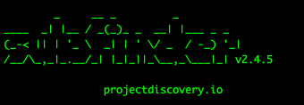

# SUBFINDER



## What is Subfinder?
Subfinder is an open-source subdomain discovery tool that gathers subdomains from various online sources (like search engines, APIs, and DNS records). This helps in reconnaissance by identifying potential attack surfaces on a target domain.

## Installation Instructions

1. Open your terminal
2. Run the following commands
```bash
sudo apt update
sudo apt install golang
go install -v github.com/projectdiscovery/subfinder/v2/cmd/subfinder@latest
```
3. Once installed, make sure it’s accessible by adding the $HOME/go/bin directory to your system's PATH:
```bash
export PATH=$PATH:$(go env GOPATH)/bin
```
4. Now verify your instalation by running
```bash
subfinder -h
```
> This should display subfinder help menu if installed correctly

### Setting Up API Keys (Optional but Recommended)

Subfinder works best when you configure API keys for online services it queries (e.g., Shodan, VirusTotal). API keys give you access to more subdomain results.

1. Locate the configuration file:
```bash
nano ~/.config/subfinder/config.yaml
```
2. Add your API keys (you’ll need to create accounts on supported platforms like VirusTotal or Shodan to get these keys).
3. Save and exit the file.

## Using Subfinder
Here are some basic and advanced commands to get started:

**Basic Command**  
To find subdomains for a target domain:

```bash
subfinder -d example.com
```
-d specifies the target domain.
Results will be displayed in the terminal.

**Save Results to a File**  
To save the discovered subdomains to a file:

```bash
subfinder -d example.com -o subdomains.txt
```
-o specifies the output file name.

**Quiet Mode**  
To suppress extra output and show only subdomains:

```bash
subfinder -d example.com -silent
```

**Using Multiple Domains**  
If you have a list of domains (e.g., domains.txt):
```bash
subfinder -dL domains.txt -o results.txt
```
-dL specifies a file containing multiple domains.

## Advanced Usage
**Set Custom DNS Resolvers**  
To improve accuracy and speed:

```bash
subfinder -d example.com -r 8.8.8.8,1.1.1.1
```
-r specifies DNS resolvers (e.g., Google’s and Cloudflare’s DNS).

**Use a Specific Source**  
To use a particular data source (e.g., CertSpotter):

```bash
subfinder -d example.com -sources certspotter
```

**Limit the Number of Threads**  
To control the speed and avoid getting blocked:

```bash
subfinder -d example.com -t 10
```
-t limits the number of concurrent threads.

## Best Practices
**Combine Tools**: Subfinder is excellent, but combining it with other tools like Amass or Assetfinder can give more comprehensive results.  
**Filter Results**: Use tools like grep or sort to clean and filter the subdomains.
```bash
sort -u subdomains.txt > unique_subdomains.txt
```
**Check for Live Domains**: Use tools like httpx to see which subdomains are live.
```bash
cat subdomains.txt | httpx -silent
```
## Example Workflow
Here’s a sample workflow to discover and filter subdomains for example.com:

Discover subdomains and save them to a file:
```bash
subfinder -d example.com -o subdomains.txt
```
Sort and remove duplicates:
```bash
sort -u subdomains.txt > unique_subdomains.txt
```
Check which subdomains are live:
```bash
cat unique_subdomains.txt | httpx -silent > live_subdomains.txt
```
## Help and Resources
Run `subfinder -h` to see all options and usage.
Check the [official documentation](https://github.com/projectdiscovery/subfinder) for more details.    
> By practicing these steps and experimenting with different options, you’ll become more comfortable with Subfinder and its capabilities.
